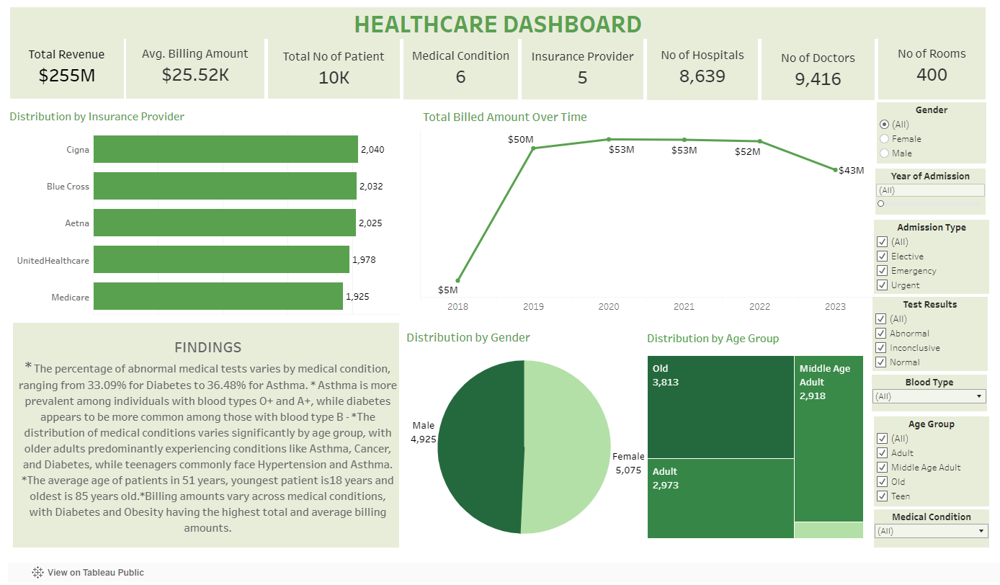

# Healthcare Data Exploration and Visualization


## Table of Contents
- [Project Overview](#project_overview)
- [Data Sources](#data_sources)
- [Tools](#tools)
- [Approach Used](#approach_used)
- [Problem Statatment Questions](#problem_statement_questions)
- [SQL Code](#sql_code)
- [Data Visualization](#data-visualization)
- [Results/Findings](#results_/_findings)
- [Recommendations](#recommendations)


### Project Overview
---
In this project, I explore a comprehensive healthcare dataset using Excel, SQL, and Tableau to uncover valuable insights. By examining patient demographics, medical conditions, billing trends, and more, my goal is to gain a deeper understanding of healthcare delivery and patient outcomes, ultimately aiding informed decision-making in healthcare. Through interactive visualizations and analysis, I aim to provide actionable insights and facilitate data-driven strategies in the healthcare industry.

### Data Sources
---
Healthcare Dataset: Obtained from Kaggle, this synthetic healthcare dataset is provided in CSV format. It offers a realistic simulation of healthcare data for analysis, covering patient demographics, medical conditions, and billing information.

### About Data
---

The dataset was obtained from the [Kaggle Healthcare Dataset](https://www.kaggle.com/datasets/prasad22/healthcare-dataset) This dataset contains healthcare information over the years. The data contains 15 columns and 10,000 rows:

| Column                  | Description                             | Data Type      |
| :---------------------- | :-------------------------------------- | :------------- |
| Name              | The  name of the patient associated with the healthcare record             | VARCHAR(50)    |
| Age                 | The age of the patient at the time of admission, expressed in years        | INT     |
| Gender                   | The he gender of the patient, either "Male" or "Female"            | VARCHAR(10)    |
| Blood Type           | The patient's blood type              | VARCHAR(3)    |
| Medical Condition            | The primary medical condition or diagnosis associated with the patient        | VARCHAR(20)   |
| Date of Admission            |    The date on which the patient was admitted to the healthcare facility            | DATE |
| Doctor                | The name of the doctor responsible for the patient's care during their admission          | VARCHAR(50)            |
| Hospital                |  The healthcare facility or hospital where the patient was admitted       | VARCHAR(50)    |
| Insurance Provider                   | The patient's insurance provider          | VARCHAR(50)  |
| Billing Amount                    | The amount of money billed for the patient's healthcare services during their admission | INT         |
| Room Number                  | The room number where the patient was accommodated during their admission | INT      |
| Admission Type                | The type of admission, which can be "Emergency," "Elective," or "Urgent"                 | VARCHAR(20) |
| Discharge Date                   | The date on which the patient was discharged from the healthcare facility                    | DATE |
| Medication | The medication prescribed or administered to the patient during their admission                | VARCHAR(20)   |
| Test Results          | The results of a medical test conducted during the patient's admission                         | VARCHAR(20)  |


### Tools
---
- Microsoft Excel for Data Cleaning and Preparation
     - [Download Dataset Here](https://www.kaggle.com/datasets/prasad22/healthcare-dataset)
- Microsoft SQL Server for Data Manipulation and Exploration
- Tableau for Data Visualization

### Approach Used
---
1. **Data Cleaning and Preparation Using Excel:** In the data preparation phase, we performed the fo,lowing tasks:
> 1. Identify missing values in the dataset using Excel's filtering
> 2. Identify and remove duplicate rows or records from the dataset
> 3. Format the billing amount column to currency and round up the amounts to a whole number

2. **Data Wrangling:** This is the step where inspection of data is done to make sure **NULL** values and missing values are detected and data replacement methods are used to replace, missing or **NULL** values.

> 1. Build a database
> 2. Import healthcare data csv file.
> 3. Select columns with null values in them. There are no null values in our database as in creating the tables, we set **NOT NULL** for each field, hence null values are filtered out.

3. **Segementation Analysis of Age Demographic:**: This will hwlp segement the age demographic into groups
   > 1. Age BETWEEN 0 AND 12 = Child
   > 2. Age BETWEEN 13 AND 19 = Teen
   > 3. Age BETWEEN 20 AND 39 = Adult
   > 4. Age BETWEEN 40 AND 59 = Middle Age Adult
   > 5. Age BETWEEN 60 AND Above = Old


4. **Feature Engineering:** This will help use generate some new columns from existing ones.

> 1. Add a new columns named `age_group` that contains the age segementation of the patient (Child, Teen, Adult).

> 2. Add a new columns named `day_of_admission` and `day_of_discharge` that contains the extracted days of the week on which the patient was admitted and discharged (Mon, Tue, Wed, Thur, Fri). This will help answer the question on which week of the hospital is busiest.

> 3. Add a new columns named `month_of_admission` and `month_of_discharge` that contains the extracted months of the year on which the patient was admitted and discharged (Jan, Feb, Mar). Help determine which month of the year has the most patient.

> 4. Add a new columns named `year_of_admission` and `year_of_discharge` that contains the extracted months of the year on which the patient was admitted and discharged (2021, 2022, 20023). Help determine trend over time.

5. **Statistical Summary Analysis**
 This analysis aims to provide insights into the key characteristics and distribution of variables in the healthcare dataset.
> **Summary Statistics:**
> - Mean Age: Average age of patients.
> - Minimum Age: Smallest observed age.
> - Maximum Age: Largest observed age.
> - Mode Blood Type: Most common blood type.
> - Minimum Length of Stay: Shortest duration in hospital.
> - Maximum Length of Stay: Longest duration in hospital.
> - Average Length of stay: Mean duration in the hospital.
> - Sum of billing amount: Total billed for healthcare.
> - Average billing amount: Mean billed per patient.
> - Minimum billing amount: Smallest billed amount.
> - Maximum billing amount: Largest billed amount.
> - Standard Deviation of Age: Measure of the dispersion of ages around the mean.
> - Standard Deviation of Billing Amount: Measure of the variability of billed amounts around the mean.

6. **Exploratory Data Analysis (EDA):** Exploratory data analysis is done to answer the listed questions and aims of this project.
   
### Problem Statement Questions
---
1. What is the length of stay and average length of stay for patients in the hospital?
2. How does the frequency of medical tests vary based on different admission types ?
3. What is the total billing amount and average billing amount per patient for each medical condition?
4. Are there any trends in billing amounts over time?
5. Are there any significant differences in billing amounts between patients with different insurance providers?
6. What percentage of medical tests have abnormal results, and how does this vary by medical condition?
7. The relationship between distribution of age group by billing amount
8. How does the distribution of medical conditions vary by age group?
9. The relationship between distribution of medical conditions by blood type?
10. The relationship between distribution of medical conditions by gender?
11. How does the distribution of insurance providers vary across different age group?
12. What is the distribution of test results for patients with different medical conditions?
13. Are there any notable differences in test result outcomes for patients with different medical conditions?
14. Identify any monthly patterns in the occurrence of specific medical conditions?
15. What are the busiest day,month and year of admission, and how many admissions were recorded ?
16. What is the distribution of discharge dates across different months and years?

### SQL Code
---
For the rest of the code, check the [SQL Code](SQLQuery.sql) file
```SQL
CREATE DATABASE healthcare_database;

---import helathcare csv file

SELECT *
  FROM healthcare;


```
### Data Visualization
After the exploratory analysis, the healthcare results were loadeed to Tableau for visualization.
- To view the dashboard on Tableau, click here [Healthcare Dashboard]( https://public.tableau.com/app/profile/mabel.olachi.chukwuma/viz/HEALTHCAREDASHBOARD_17120690141660/Dashboard1)
  

---

### Results/ Findings
---
   - Frequency varies significantly based on admission type, with the most common result being "Abnormal."
   - Billing amounts vary across medical conditions, with Diabetes and Obesity having the highest total and average billing amounts.
   - There is a decreasing trend in total billing amounts over the years from 2020 to 2023.
   - There are significant differences in billing amounts among patients with different insurance providers, with Aetna having the 
     highest total and average billing amount.
   - The percentage of abnormal medical tests varies by medical condition, ranging from 33.09% for Diabetes to 36.48% for Asthma.
   - Billing amounts show little variation across age groups, with the average billing amount remaining consistent.
   - The distribution of medical conditions varies significantly by age group, with older adults predominantly experiencing conditions 
    like Asthma, Cancer, and Diabetes, while teenagers commonly face Hypertension and Asthma.
   - Asthma is more prevalent among individuals with blood types O+ and A+, while diabetes appears to be more common among those with 
     blood type B-.
   - Older individuals may be more inclined to use Medicare, while younger age groups may opt for private insurance providers like 
     Aetna or Blue Cross.
   - Patients with asthma may frequently exhibit abnormal test results, suggesting the need for closer monitoring or specialized 
     treatment approaches.
   - Busiest Day, Month, and Year of Admission: Wednesday has the highest number of admissions across various years and months, 
    indicating a consistent trend.October and November observe higher admission rates compared to other months. 2019 and 2020 recorded 
    higher admissions compared to other years, with a noticeable decline in 2021 and a subsequent increase in 2022 and 2023.
   - Distribution of Discharge Dates: March has the highest number of discharges, followed by October and May, suggesting a possible 
     correlation with seasonal health patterns or medical procedures. Discharge counts vary across different years, with notable peaks 
     in 2022 and 2023, indicating potential shifts in healthcare demand or treatment durations over time.
   - The average age of patients in the healthcare system is 51 years, with the youngest patient being 18 years old and the oldest being 85 years old. The standard deviation of ages around the mean is approximately 19.59 years.
   - The minimum billing amount recorded for healthcare services is $1000, while the maximum billing amount is $49,996. On average, each patient's billed amount is $25,516, resulting in a total revenue of $255,168,084. The standard deviation of billed amounts around the mean is approximately 
      $14,067.29.
   - The most common blood type observed among patients is AB-. 
   - Patients have experienced a minimum length of stay of 1 day and a maximum length of stay of 30 days, with an average length of stay of 15 days.
     

### Recommendations
---

- Implement robust monitoring systems for abnormal test results to ensure timely intervention and management.
- Consider tailoring treatment approaches for asthma patients based on blood type.
- Develop targeted health education programs for older adults to raise awareness and promote preventive measures.
- Strategically allocate resources to address fluctuations in demand and optimize operational efficiency.
- Optimize insurance coverage options to ensure equitable access to quality care for patients.
- Prioritize continuous quality improvement initiatives to enhance patient care delivery and organizational performance.
- Invest in technology and infrastructure to streamline workflows and improve communication across the healthcare continuum.
---


